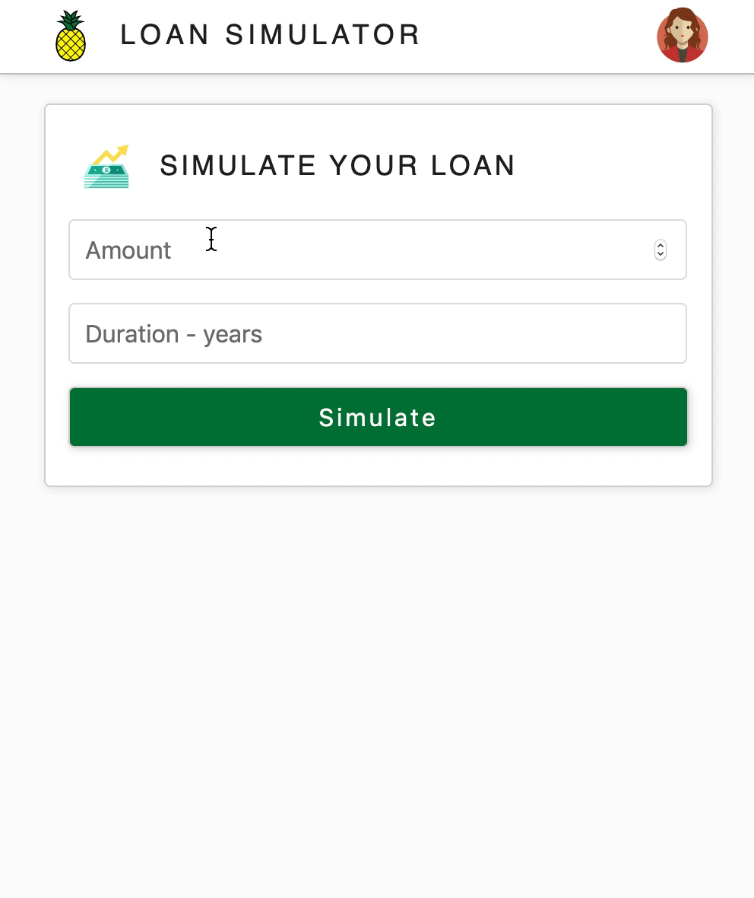
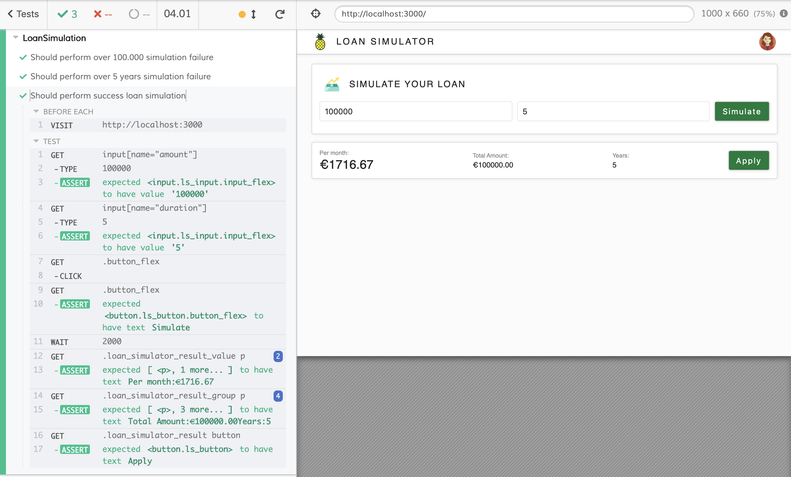

Loan Simulator is a simple SPA that uses [surge](https://surge.sh) to be deployed

[Live Demo](http://loan-simulator.surge.sh/)

### `How to run`

Install project dependencies

`yarn` or `npm intall`

Run it locally

`yarn start`

### `How to deploy`

Install project dependencies

`yarn` or `npm intall`

Build project

`yarn build`

Run deployment script

`yarn deploy`

Access final result under

`http://loan-simulator.surge.sh/`

### `Unit Tests`

To run then just use the command

`yarn test`

### `Integration Tests`

To run then just use the command

`yarn cy:open`

and then choose `loan_simulation_flow.spec.js`